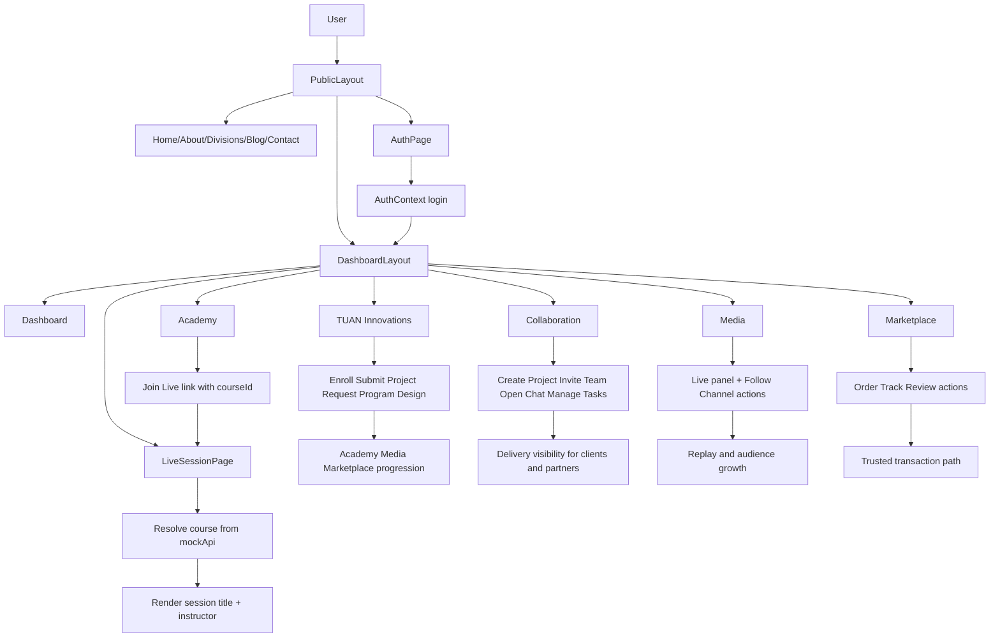

# TUAN Creations Front-End

This document describes the current front-end architecture and user flow for the TUAN Digital Platform web application.

## 1. Front-End Architecture

### 1.1 Stack

- React 18 + TypeScript
- Vite build tooling
- React Router for navigation
- Tailwind + custom CSS variables for styling
- Local React Context for authentication state

### 1.2 App Composition

The app bootstraps from `src/main.tsx` and wraps the router with `AuthProvider`.

Core composition:

- `src/main.tsx`: renders `BrowserRouter`, `AuthProvider`, and root app
- `src/App.tsx`: central route map
- `src/layouts/PublicLayout.tsx`: public site shell
- `src/layouts/DashboardLayout.tsx`: platform workspace shell

### 1.3 Route Topology

Public routes (inside `PublicLayout`):

- `/` Home
- `/about` About
- `/divisions` Divisions
- `/blog` Blog
- `/contact` Contact
- `/auth` Auth

Platform routes (inside `DashboardLayout`):

- `/dashboard` Dashboard
- `/academy` Academy
- `/live-session` Live session room
- `/marketplace` Marketplace
- `/media` Media
- `/collaboration` Collaboration
- `/iot` TUAN Innovations

Fallback behavior:

- Unknown routes redirect to `/`.

### 1.4 State Architecture

Global auth state (`src/store/auth.tsx`):

- `user` object (`id`, `name`, `email`, `role`)
- `login(payload)` creates authenticated session
- `logout()` clears session
- Session persistence via localStorage key: `tuan_os_auth_user`

Feature-local state:

- Module pages use local `useState`/`useMemo`/`useEffect` for UI concerns
- `src/pages/LiveSessionPage.tsx` manages countdown, chat, participants, media controls, and notifications locally

### 1.5 Data Layer (Current)

Static/mock domain data in `src/services/mockApi.ts`:

- `dashboardMetrics`
- `courses`
- `listings`

This acts as an in-app data source until API integration is introduced.

### 1.6 Live Session Integration (Updated)

Academy cards now carry course context into the live room:

- In `src/modules/academy/AcademyPage.tsx`, Join Live links to `/live-session?courseId=<id>`
- In `src/pages/LiveSessionPage.tsx`, `courseId` is read from query params and mapped to `courses`
- Session header (title + instructor) updates to the selected course

## 2. User Flow

### 2.1 Public Discovery Flow

1. User lands on Home.
2. User explores About, Divisions, Blog, or Contact.
3. User chooses a CTA to enter the platform (`/dashboard`) or authenticate (`/auth`).

### 2.2 Authentication Flow

1. User opens `/auth`.
2. User submits name, email, and role.
3. Auth context stores user and redirects to platform dashboard.

### 2.3 Dashboard Access Flow

1. If user is not authenticated, dashboard renders guest messaging and auth prompts.
2. If user is authenticated, dashboard renders role-aware workspace messaging and sign-out.
3. User navigates modules from sidebar nav.

### 2.4 Academy to Live Session Flow (Detailed)

1. User opens Academy module (`/academy`).
2. User clicks Join Live on a specific course card.
3. App navigates to `/live-session?courseId=<courseId>`.
4. Live session page resolves `courseId` and displays matching course title/instructor.

### 2.5 Live Session Room Flow (Detailed)

1. Entry state:
	- session starts as `scheduled`
	- countdown timer initializes from `startTime`
	- subscribe overlay is visible before going live
2. Notification subscription:
	- user enters email, country code, and phone number
	- validation enforces all fields before success
	- toast feedback confirms success or error
3. Transition to live:
	- countdown reaches zero
	- session status updates to `live`
	- subscribe overlay auto-hides
4. Live interaction:
	- participant list reflects online users
	- chat supports message send and auto-scroll
	- controls support mute, video toggle, raise hand, and recording toggle
5. Supplemental content:
	- resources are available as links
	- previous session recordings are shown as links

### 2.6 Marketplace Flow (Detailed)

1. Entry point:
	- user opens `/marketplace` from dashboard sidebar or discovery links
2. Listing discovery:
	- cards render from `listings` data in `src/services/mockApi.ts`
	- each card displays type, provider, verification state, and price
3. Trust and decision support:
	- verification badge communicates provider confidence level
	- pricing and provider identity are visible before action
4. Action stage:
	- user can click Order, Track, or Review actions on each listing
	- current implementation presents UI actions (interaction endpoints for API wiring)
5. Expected role outcomes:
	- client role: shortlist providers, place service/product orders
	- partner role: benchmark competing offers and trust signals
	- investor role: observe marketplace activity patterns from visible catalog dynamics

### 2.7 Media Flow (Detailed)

1. Entry point:
	- user opens `/media` from dashboard nav
2. Live broadcast focus:
	- hero video panel highlights the current live program slot
	- copy indicates that broadcasts are retained for replay
3. Channel exploration:
	- channel cards render audience size and status (`Live now`, `New episode`, `Recording archive`)
4. Engagement action:
	- user can trigger Follow Channel on each card
	- current implementation captures interaction intent at UI level
5. Audience-specific outcomes:
	- students: discover educational broadcasts and replay entries
	- clients: learn provider capabilities and case narratives through shows
	- partners: gain visibility by associating with active media channels
	- investors: monitor ecosystem communication reach and consistency

### 2.8 Collaboration Flow (Detailed)

1. Entry point:
	- user opens `/collaboration`
2. Workspace setup:
	- top actions support Create Project and Invite Team
	- messaging frames the space for partners, freelancers, and clients
3. Project pipeline visibility:
	- project cards show name, team size, and lifecycle status (`Planning`, `In Progress`, `Delivery`)
4. Operational actions:
	- Open Chat action represents communication channel entry
	- Manage Tasks action represents execution tracking entry
5. Delivery outcome:
	- teams maintain a single shared view of scope, communication, and progress
	- clients and partners can align from kickoff to handover

### 2.9 TUAN Innovations Flow (Detailed)

1. Entry point:
	- user opens `/iot` (labeled TUAN Innovations in dashboard nav)
2. Program discovery:
	- hero section presents innovation positioning and CTA options
	- users can choose Join Innovation Program or Request Starter Kit
3. Capability orientation:
	- outcome list explains practical pathways (kits, mentorship, prototypes, chip design)
	- support section defines target personas and guest-to-member access model
4. Program enrollment flow:
	- program cards show mode, summary, and available seats
	- users can trigger Enroll, View Resources, or Submit Project actions
5. Custom engagement flow:
	- institutions can request tailored innovation tracks via Request Program Design
	- users can escalate directly via Talk to Innovation Team
6. Cross-module progression:
	- innovation outputs can feed into Academy learning, Media visibility, and Marketplace commercialization paths

### 2.10 End-to-End Cross-Module Journey

1. User discovers TUAN value proposition on public pages.
2. User enters dashboard as guest or authenticated member.
3. User selects module by need:
	- learning need: Academy -> Live Session
	- buying/selling need: Marketplace
	- broadcast/content need: Media
	- delivery/team need: Collaboration
	- prototyping/R&D need: TUAN Innovations
4. User progresses from exploration actions to deeper account-required workflows as APIs and backend services are integrated.

## 3. Diagram (Flow + Containers)

## 4. Next Step (Optional)

To evolve this architecture, the next logical step is replacing `mockApi.ts` with real service modules (academy, marketplace, media, auth) and a shared API client layer.
